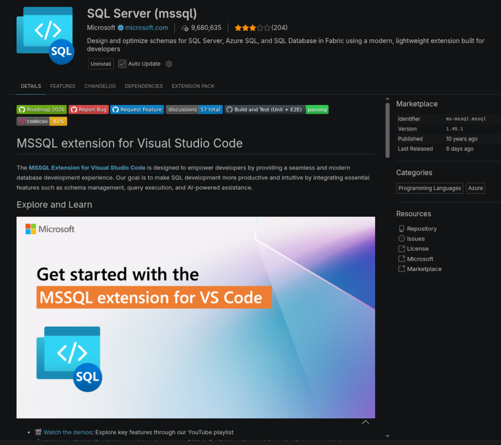
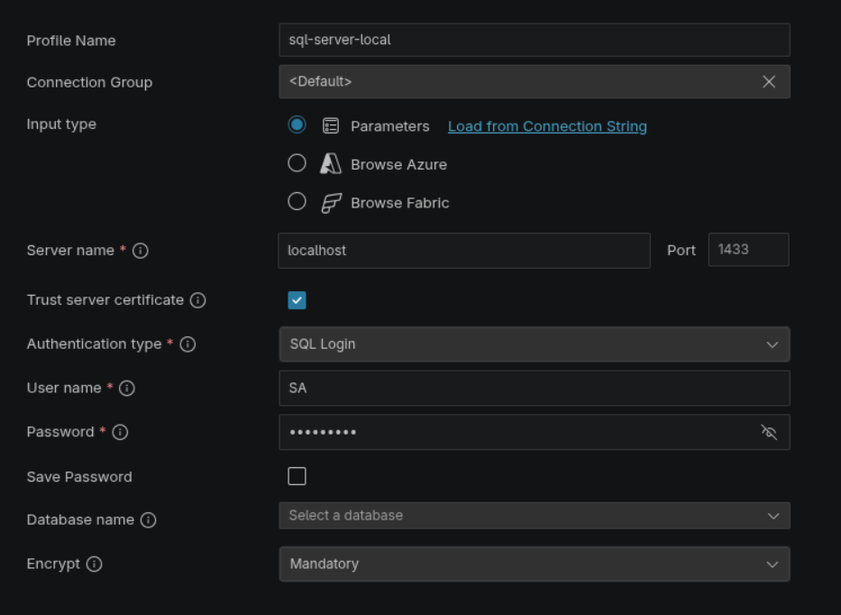
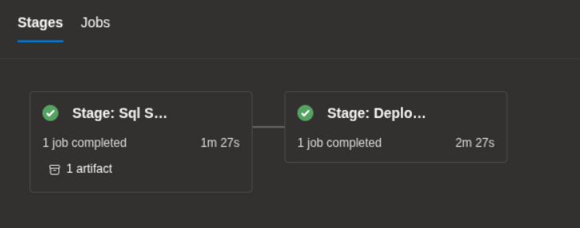
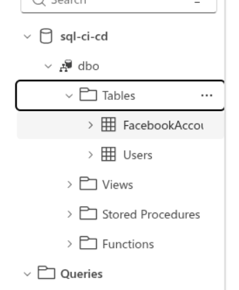

# sql-server-docker

## run sql-server

- download docker sql-server image

```sh
docker pull mcr.microsoft.com/azure-sql-edge:latest
```

- run sql-server

```sh
docker run \
--name=sql-server-local \
--rm \
-e 'ACCEPT_EULA=1' \
-e 'MSSQL_SA_PASSWORD=sample@!2' \
-e 'MSSQL_PID=Developer' \
-e 'MSSQL_USER=SA' mcr.microsoft.com/azure-sql-edge:latest
```

- docker compose sql-server-local

```sh
docker compose -f sql-server-local.yml up -d
```

- vscode plugin sql-server



- example connection



## azure devops

- check pipeline and deploy




## references

- check out [azure sql edge](https://hub.docker.com/r/microsoft/azure-sql-edge)
- check out [mssql-tools](https://hub.docker.com/r/microsoft/mssql-tools/)
