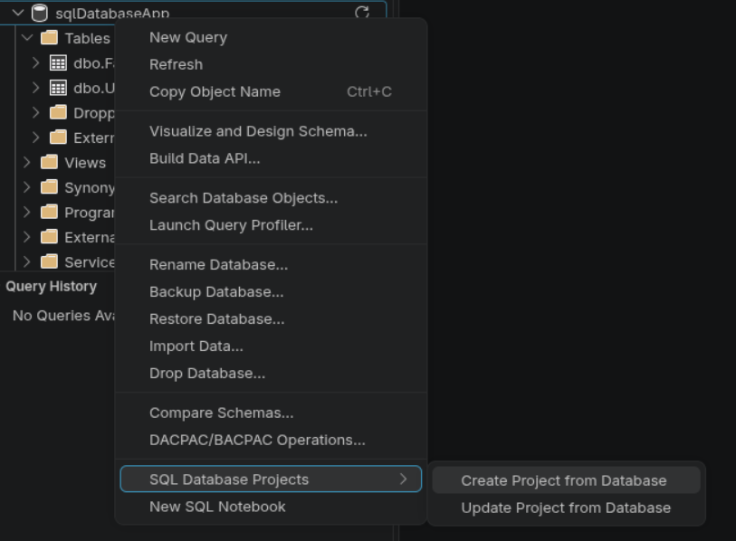
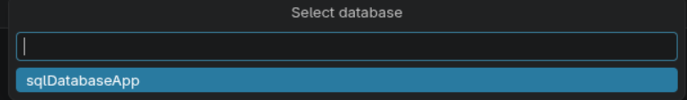
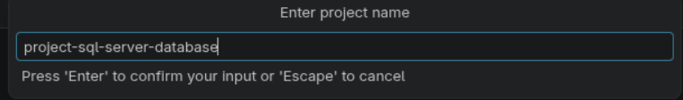
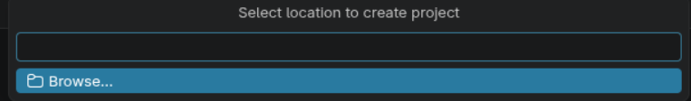
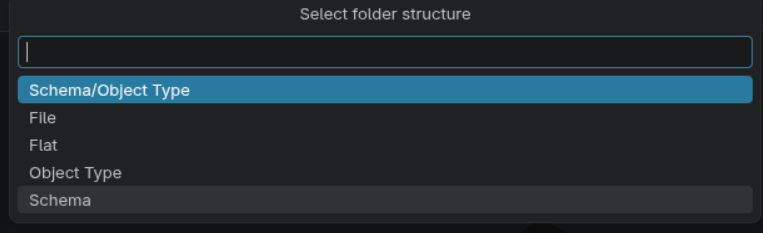
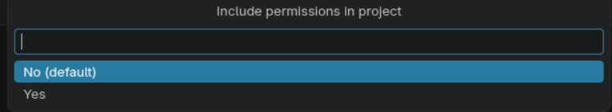
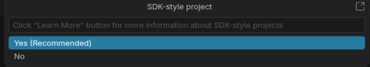
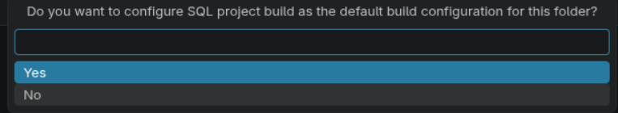
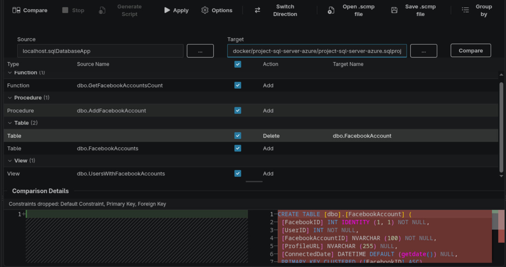
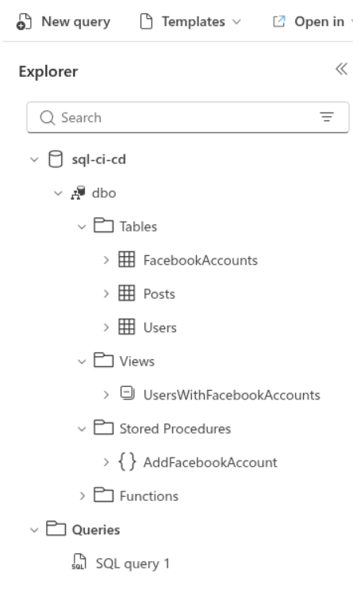

# sql-database-project

- steps for create sql database project

- example update sql project

- example create table posts and update

## references

- check out [sql database projects](https://learn.microsoft.com/ga-ie/sql/tools/visual-studio-code-extensions/sql-database-projects/getting-started-sql-database-projects-extension?view=sql-server-ver17#1)
- check out [sql server data tools](https://learn.microsoft.com/it-it/sql/ssdt/sql-server-data-tools?view=aps-pdw-2016#1)
